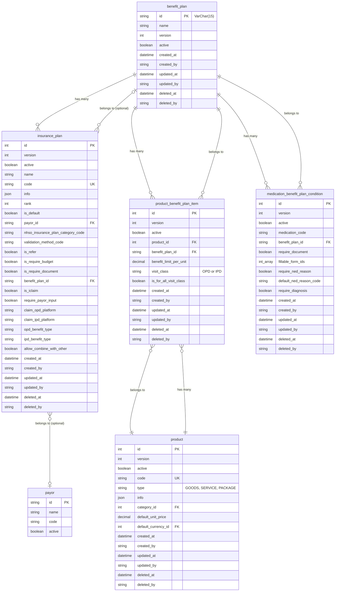

# Benefit Plan ER Diagram

This diagram shows the relationships between the `benefit_plan` table and related entities in the EMR system.

## Relationship Summary

### BenefitPlan (Central Entity)

**One-to-Many Relationships:**

1. **benefit_plan → insurance_plan**
   - A benefit plan can be used by multiple insurance plans
   - Insurance plans optionally reference a benefit plan via `benefit_plan_id`
   - Relationship: Optional (insurance plan may not have a benefit plan)

2. **benefit_plan → product_benefit_plan_item**
   - A benefit plan defines pricing/limits for multiple products
   - Links products to benefit plans with specific benefit limits per unit
   - Includes visit class filtering (OPD/IPD or all)
   - Relationship: Required

3. **benefit_plan → medication_benefit_plan_condition**
   - A benefit plan can have special conditions for specific medications
   - Defines requirements like documents, NED reasons, or diagnosis
   - Relationship: Required

### Related Entities

**Product:**
- Products are linked to benefit plans through `product_benefit_plan_item`
- Each product can have different benefit limits for different benefit plans
- Can specify different limits for OPD vs IPD visits

**InsurancePlan:**
- Insurance plans optionally reference a benefit plan
- Also references a payor (insurance company)
- Contains claim platform configurations and benefit types

**Payor:**
- Represents insurance companies or payment entities
- Referenced by insurance plans

## Key Business Rules

1. **Product Benefit Limits**: Each product can have different benefit limits per unit depending on the benefit plan and visit class (OPD/IPD)

2. **Medication Conditions**: Certain medications may require additional documentation or diagnosis when used with specific benefit plans

3. **Insurance Plan Flexibility**: Insurance plans can optionally use a benefit plan, allowing for flexible pricing structures

4. **Visit Class Segregation**: Benefits can be configured differently for outpatient (OPD) vs inpatient (IPD) visits
