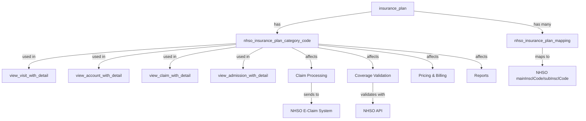

# ผลกระทบของ nhso_insurance_plan_category_code

## ภาพรวม

`nhso_insurance_plan_category_code` เป็น field ใน `insurance_plan` table ที่ใช้เก็บรหัสประเภทสิทธิการรักษาตามมาตรฐาน สปสช. (สำนักงานหลักประกันสุขภาพแห่งชาติ)

## ตำแหน่งใน Schema

```prisma
model InsurancePlan {
  // ... fields อื่นๆ
  nhsoInsurancePlanCategoryCode String? @map("nhso_insurance_plan_category_code") @db.VarChar(15)
  // ... fields อื่นๆ
}
```

**ประเภทข้อมูล:** `String?` (nullable, ความยาวสูงสุด 15 ตัวอักษร)

## ส่วนที่ได้รับผลกระทบ

### 1. **Database Views (มุมมองฐานข้อมูล)**

Field นี้ถูกนำไปแสดงใน Views หลายตัว เพื่อให้สามารถ query ข้อมูลได้สะดวก:

#### 1.1 `view_visit_with_detail`
- แสดงข้อมูล `nhso_insurance_plan_category_code` ใน coverage usage details
- ใช้สำหรับแสดงข้อมูลการเข้ารับบริการพร้อมรายละเอียดสิทธิ์

#### 1.2 `view_account_with_detail`
- แสดงข้อมูลสิทธิ์ที่ใช้ในบัญชีค่ารักษา
- ใช้ในการคำนวณและแสดงรายละเอียดการเรียกเก็บเงิน

#### 1.3 `view_claim_with_detail`
- แสดงข้อมูลสิทธิ์ในการเคลม
- สำคัญสำหรับการส่งเคลมไปยัง สปสช.

#### 1.4 `view_active_admissions_and_encounter`
- แสดงข้อมูลผู้ป่วยใน/นอกที่กำลังรับบริการอยู่
- รวมข้อมูลสิทธิ์ที่ใช้

#### 1.5 `view_admission_with_detail`
- แสดงรายละเอียดการ admit ผู้ป่วยใน
- รวมข้อมูลสิทธิ์การรักษา

### 2. **Relationship กับ Tables อื่น**

#### 2.1 `nhso_insurance_plan_mapping`
```prisma
model NhsoInsurancePlanMapping {
  id                    Int           @id
  mainInsclCode         String        // รหัสสิทธิ์หลัก
  subInsclCode          String?       // รหัสสิทธิ์ย่อย
  isOnlyForMainHospital Boolean
  insurancePlanId       Int
  insurancePlan         InsurancePlan @relation(...)
}
```

**ความสัมพันธ์:**
- `insurance_plan` มี mapping หลายรายการไปยัง NHSO inscription codes (mainInsclCode, subInsclCode)
- ใช้สำหรับแปลงรหัสสิทธิ์ภายในระบบไปเป็นรหัสที่ สปสช. ใช้

### 3. **Business Logic ที่เกี่ยวข้อง**

#### 3.1 การตรวจสอบสิทธิ์ (Coverage Validation)
- ใช้ในการระบุประเภทสิทธิ์เมื่อตรวจสอบสิทธิ์การรักษา
- เชื่อมโยงกับ `validation_method_code` เพื่อกำหนดวิธีการตรวจสอบ

#### 3.2 การเคลมค่ารักษา (Claim Processing)
- ใช้ในการจัดกลุ่มและส่งข้อมูลเคลมตามประเภทสิทธิ์
- เชื่อมโยงกับ `claim_opd_platform` และ `claim_ipd_platform`

#### 3.3 การคำนวณค่ารักษา (Pricing & Billing)
- ใช้ร่วมกับ `benefit_plan` ในการคำนวณสิทธิประโยชน์
- กำหนดว่าจะใช้ราคาแบบไหน (เช่น UC, SSS, OFC)

### 4. **ตัวอย่างค่าที่ใช้ในระบบ**

จากข้อมูล mock และ test:

| รหัส | ชื่อสิทธิ์ | คำอธิบาย |
|------|-----------|----------|
| `UCS` | บัตรทอง | หลักประกันสุขภาพถ้วนหน้า (Universal Coverage Scheme) |
| `SSS` | ประกันสังคม | สิทธิ์ประกันสังคม (Social Security Scheme) |
| `OFC` | ข้าราชการ | สิทธิ์ข้าราชการ (Civil Servant Medical Benefit Scheme) |
| `1`, `2` | อื่นๆ | รหัสสิทธิ์อื่นๆ ที่กำหนดเอง |

### 5. **การใช้งานใน Application Layer**

#### 5.1 Visit Service
- ใช้ในการสร้างและจัดการข้อมูลการเข้ารับบริการ
- แสดงข้อมูลสิทธิ์ให้ผู้ใช้เห็น

#### 5.2 Admission Service
- ใช้ในการ admit ผู้ป่วยใน
- ตรวจสอบสิทธิ์และแสดงข้อมูล

#### 5.3 Encounter Service
- ใช้ในการบันทึกการพบแพทย์
- เชื่อมโยงกับสิทธิ์ที่ใช้

#### 5.4 Cashier/Billing Service
- ใช้ในการคำนวณค่ารักษา
- แสดงในใบเสร็จและเอกสารทางการเงิน

### 6. **Reports & Analytics**

Field นี้ถูกใช้ในรายงานต่างๆ:
- รายงานสรุปการใช้สิทธิ์
- รายงานการเคลม
- รายงานรายได้แยกตามประเภทสิทธิ์
- รายงานสถิติผู้ป่วยแยกตามสิทธิ์

### 7. **Integration Points**

#### 7.1 NHSO API Integration
- ใช้ในการเชื่อมต่อกับระบบ สปสช.
- ส่งข้อมูลเคลมตามประเภทสิทธิ์

#### 7.2 E-Claim System
- ใช้ในการส่งข้อมูลเคลมอิเล็กทรอนิกส์
- เชื่อมโยงกับ `eclaim_statement_format`

## สรุปผลกระทบ

### ผลกระทบหลัก (Critical Impact):
1. **การเคลมค่ารักษา** - จำเป็นต้องมีเพื่อส่งเคลมไปยัง สปสช.
2. **การคำนวณสิทธิประโยชน์** - ใช้ในการกำหนดว่าผู้ป่วยมีสิทธิ์อะไรบ้าง
3. **การตรวจสอบสิทธิ์** - ใช้ในการ validate สิทธิ์การรักษา

### ผลกระทบรอง (Secondary Impact):
1. **Reporting** - ใช้ในรายงานต่างๆ
2. **UI/UX** - แสดงข้อมูลสิทธิ์ให้ผู้ใช้เห็น
3. **Data Analytics** - ใช้ในการวิเคราะห์ข้อมูล

### ข้อควรระวัง:
- Field นี้เป็น **nullable** ดังนั้นต้องจัดการกรณีที่ไม่มีค่า
- ความยาวสูงสุด **15 ตัวอักษร** ต้องตรวจสอบก่อน insert/update
- ต้องมีการ mapping ที่ถูกต้องกับ `nhso_insurance_plan_mapping` เพื่อให้เคลมได้

## Diagram แสดงความสัมพันธ์



## คำแนะนำในการใช้งาน

1. **เมื่อสร้าง Insurance Plan ใหม่:**
   - ระบุ `nhso_insurance_plan_category_code` ให้ถูกต้องตามมาตรฐาน สปสช.
   - สร้าง mapping ใน `nhso_insurance_plan_mapping` ด้วย

2. **เมื่อทำการเคลม:**
   - ตรวจสอบว่ามี `nhso_insurance_plan_category_code` ก่อนส่งเคลม
   - ใช้ code นี้ในการจัดกลุ่มและส่งข้อมูล

3. **เมื่อทำรายงาน:**
   - ใช้ field นี้ในการ filter และ group by ข้อมูล
   - แสดงชื่อสิทธิ์ที่เข้าใจง่ายแทนการแสดง code โดยตรง
