# Product, Insurance และ Benefit Relationship Diagram

## ภาพรวมความสัมพันธ์

เอกสารนี้แสดงความสัมพันธ์ระหว่าง Product (สินค้า/บริการ), Insurance Plan (แผนประกัน) และ Benefit Plan (แผนสิทธิประโยชน์) ในระบบ EMR

## ER Diagram แบบเต็ม

```mermaid
erDiagram
    %% Core Entities
    product ||--o{ product_benefit_plan_item : "has pricing for"
    product ||--o{ product_insurance_plan_benefit_item : "has pricing for"
    product ||--o{ account_charge_item : "charged in"
    product ||--o{ invoice_charge_item : "invoiced in"
    product ||--o{ product_package_item_parent : "contains (as parent)"
    product ||--o{ product_package_item_child : "part of (as child)"
    product ||--o{ to_change_product_price : "has price changes"
    product ||--o{ product_order_item : "ordered as"
    product ||--o{ bed_type : "used for"
    product ||--o{ activity : "linked to"
    
    %% Product Categories & Classifications
    product }o--|| product_category : "belongs to"
    product }o--o| adp_category : "classified as (ADP)"
    product }o--o| simb_category : "classified as (SIMB)"
    product }o--o| csmbs_category : "classified as (CSMBS)"
    product }o--o| nhso_category : "classified as (NHSO)"
    product }o--o| dispense_unit : "measured in"
    product }o--o| package_unit : "packaged in"
    product }o--|| currency : "priced in"
    product }o--o| cost_center : "allocated to"
    
    %% Insurance & Benefit Plans
    benefit_plan ||--o{ insurance_plan : "used by"
    benefit_plan ||--o{ product_benefit_plan_item : "defines pricing for"
    benefit_plan ||--o{ medication_benefit_plan_condition : "has conditions for"
    
    insurance_plan ||--o{ product_insurance_plan_benefit_item : "defines pricing for"
    insurance_plan ||--o{ coverage_usage : "used in"
    insurance_plan ||--o{ account_charge_item_insurance_plan_benefit : "benefits in"
    insurance_plan }o--o| benefit_plan : "references"
    insurance_plan }o--o| payor : "paid by"
    
    %% Junction Tables
    product_benefit_plan_item }o--|| product : "for product"
    product_benefit_plan_item }o--|| benefit_plan : "under plan"
    
    product_insurance_plan_benefit_item }o--|| product : "for product"
    product_insurance_plan_benefit_item }o--|| insurance_plan : "under plan"
    
    %% Billing & Charging
    account ||--o{ account_charge_item : "contains"
    account_charge_item }o--|| product : "charges for"
    account_charge_item ||--o{ account_charge_item_insurance_plan_benefit : "has benefits"
    account_charge_item_insurance_plan_benefit }o--|| insurance_plan : "from plan"
    
    invoice ||--o{ invoice_charge_item : "contains"
    invoice_charge_item }o--|| product : "bills for"
    
    %% Coverage
    coverage_usage }o--|| insurance_plan : "uses"
    coverage_usage ||--o{ coverage_usage_detail : "has details"
    
    %% Product Details
    product {
        int id PK
        string code UK
        string type "GOODS, SERVICE, PACKAGE"
        int category_id FK
        decimal default_unit_price
        int default_currency_id FK
        int cost_center_id FK
        string adp_code
        string nhso_code
        string moph_code
        json medication_data
        json lab_data
        json imaging_data
        boolean orderable
    }
    
    product_category {
        int id PK
        string code UK
        string order_type "MEDICATION, LAB, IMAGING, etc"
        json info
    }
    
    benefit_plan {
        string id PK
        string name
        boolean active
    }
    
    insurance_plan {
        int id PK
        string code UK
        string name
        string benefit_plan_id FK
        string payor_id FK
        string nhso_insurance_plan_category_code
        string validation_method_code
        boolean is_refer
        boolean is_require_budget
        string claim_opd_platform
        string claim_ipd_platform
    }
    
    product_benefit_plan_item {
        int id PK
        int product_id FK
        string benefit_plan_id FK
        decimal benefit_limit_per_unit
        string visit_class "OPD, IPD"
        boolean is_for_all_visit_class
    }
    
    product_insurance_plan_benefit_item {
        int id PK
        int product_id FK
        int insurance_plan_id FK
        decimal benefit_limit_per_unit
        string visit_class "OPD, IPD"
        boolean is_for_all_visit_class
    }
    
    account_charge_item {
        int id PK
        int account_id FK
        int product_id FK
        decimal unit_price
        decimal quantity
        decimal total_price
        decimal discount
        decimal net_price
    }
    
    invoice_charge_item {
        int id PK
        int invoice_id FK
        int product_id FK
        decimal unit_price
        decimal quantity
        decimal total_price
    }
    
    coverage_usage {
        int id PK
        string vn
        int insurance_plan_id FK
        int priority
        decimal budget_limit
        boolean active
    }
    
    payor {
        string id PK
        string name
        string code
    }
    
    currency {
        int id PK
        string code UK
        string name
        string symbol
    }
    
    cost_center {
        int id PK
        string code
        string name
        string gl_code
    }
```



## Diagram แบบย่อ - โฟกัสที่ Pricing Flow


## รายละเอียด Tables ที่เกี่ยวข้องกับ Product

### 1. **Master Data Tables**

#### 1.1 Product Category & Classification
- **product_category** - หมวดหมู่สินค้า (ยา, เวชภัณฑ์, Lab, Imaging, Activity)
- **adp_category** - หมวดหมู่ ADP (สำหรับเคลม)
- **simb_category** - หมวดหมู่ SIMB (ประกันสังคม)
- **csmbs_category** - หมวดหมู่ CSMBS (ข้าราชการ)
- **nhso_category** - หมวดหมู่ NHSO (บัตรทอง)

#### 1.2 Units & Measurements
- **dispense_unit** - หน่วยจ่าย (เม็ด, แคปซูล, ขวด)
- **package_unit** - หน่วยบรรจุ (กล่อง, ห่อ)
- **currency** - สกุลเงิน

#### 1.3 Financial
- **cost_center** - ศูนย์ต้นทุน

### 2. **Pricing & Benefit Tables**

#### 2.1 Benefit Plan Pricing
- **product_benefit_plan_item**
  - เชื่อม Product กับ Benefit Plan
  - กำหนด benefit_limit_per_unit (วงเงินสิทธิต่อหน่วย)
  - แยกตาม visit_class (OPD/IPD)

#### 2.2 Insurance Plan Pricing
- **product_insurance_plan_benefit_item**
  - เชื่อม Product กับ Insurance Plan
  - กำหนด benefit_limit_per_unit
  - แยกตาม visit_class (OPD/IPD)

#### 2.3 Price Management
- **to_change_product_price** - การเปลี่ยนแปลงราคาสินค้า

### 3. **Package & Bundle Tables**

- **product_package_item**
  - เชื่อม Product กับ Product (parent-child)
  - ใช้สำหรับ Package/Bundle
  - มี quantity กำหนดจำนวน

### 4. **Ordering & Billing Tables**

#### 4.1 Order Management
- **product_order_item** - รายการสั่งซื้อสินค้า

#### 4.2 Charging
- **account_charge_item**
  - รายการเรียกเก็บเงินในบัญชี
  - เชื่อมกับ Product
  - มี unit_price, quantity, discount, net_price

- **account_charge_item_insurance_plan_benefit**
  - สิทธิประโยชน์ที่ใช้กับรายการเรียกเก็บ
  - เชื่อมกับ Insurance Plan

#### 4.3 Invoicing
- **invoice_charge_item**
  - รายการในใบแจ้งหนี้
  - เชื่อมกับ Product

### 5. **Coverage Tables**

- **coverage_usage**
  - การใช้สิทธิ์ในแต่ละ visit
  - เชื่อมกับ Insurance Plan
  - มี priority, budget_limit

- **coverage_usage_detail**
  - รายละเอียดการใช้สิทธิ์

### 6. **Special Use Cases**

#### 6.1 Bed Management
- **bed_type** - ประเภทเตียง (เชื่อมกับ Product)

#### 6.2 Activity
- **activity** - กิจกรรมทางการแพทย์ (เชื่อมกับ Product)

#### 6.3 Food/Nutrition
- **food_grade** - เกรดอาหาร (เชื่อมกับ Product)

#### 6.4 Medication Specific
- **medication_benefit_plan_condition**
  - เงื่อนไขพิเศษสำหรับยาในแต่ละ Benefit Plan
  - กำหนดว่าต้องมีเอกสาร, ต้องระบุ diagnosis หรือไม่

## Flow การคำนวณราคาและสิทธิประโยชน์


## Business Rules

### 1. Product Pricing Priority
1. **product_insurance_plan_benefit_item** (สูงสุด) - ราคาเฉพาะ Insurance Plan
2. **product_benefit_plan_item** - ราคาตาม Benefit Plan
3. **product.default_unit_price** (ต่ำสุด) - ราคาเริ่มต้น

### 2. Visit Class Filtering
- สามารถกำหนดราคาต่างกันสำหรับ OPD และ IPD
- `is_for_all_visit_class = true` ใช้ได้ทั้ง OPD และ IPD

### 3. Benefit Limit
- `benefit_limit_per_unit` คือวงเงินสิทธิ์ต่อหน่วย
- ส่วนเกินผู้ป่วยต้องจ่ายเอง

### 4. Product Categories
- แต่ละ Product ต้องมี `product_category`
- Category กำหนด `order_type` (MEDICATION, LAB, IMAGING, ACTIVITY)
- มี category เฉพาะสำหรับการเคลม (ADP, SIMB, CSMBS, NHSO)

## ตัวอย่างการใช้งาน

### ตัวอย่าง 1: ยาที่มีราคาต่างกันตามสิทธิ์

```
Product: Paracetamol 500mg
- default_unit_price: 5.00 บาท

Product Benefit Plan Item:
- benefit_plan: UC (บัตรทอง)
- benefit_limit_per_unit: 3.00 บาท
- visit_class: OPD
→ ผู้ป่วยจ่าย: 2.00 บาท

Product Insurance Plan Benefit Item:
- insurance_plan: ประกันสังคม
- benefit_limit_per_unit: 4.00 บาท
- visit_class: OPD
→ ผู้ป่วยจ่าย: 1.00 บาท
```

### ตัวอย่าง 2: Package Product

```
Product: Health Check Up Package
- type: PACKAGE
- default_unit_price: 5000.00 บาท

Product Package Items:
1. CBC (Complete Blood Count) - quantity: 1
2. Chest X-Ray - quantity: 1
3. Doctor Consultation - quantity: 1
```

### ตัวอย่าง 3: Bed Type

```
Product: Standard Bed
- type: SERVICE
- default_unit_price: 500.00 บาท/วัน

Bed Type:
- ward: General Ward
- product: Standard Bed
→ เมื่อ admit ผู้ป่วย จะ charge ตาม product นี้
```

## สรุป

ระบบมีความซับซ้อนในการจัดการราคาและสิทธิประโยชน์:

1. **Product** เป็นศูนย์กลางของทุกอย่าง
2. **Benefit Plan** และ **Insurance Plan** กำหนดสิทธิประโยชน์
3. **Junction Tables** (product_benefit_plan_item, product_insurance_plan_benefit_item) เชื่อมและกำหนดราคา
4. **Account Charge Item** และ **Invoice Charge Item** ใช้ในการเรียกเก็บเงินจริง
5. **Coverage Usage** ติดตามการใช้สิทธิ์ในแต่ละครั้ง

การออกแบบนี้ให้ความยืดหยุ่นสูงในการกำหนดราคาและสิทธิประโยชน์ที่แตกต่างกันตามประเภทสิทธิ์และประเภทการรักษา (OPD/IPD)
