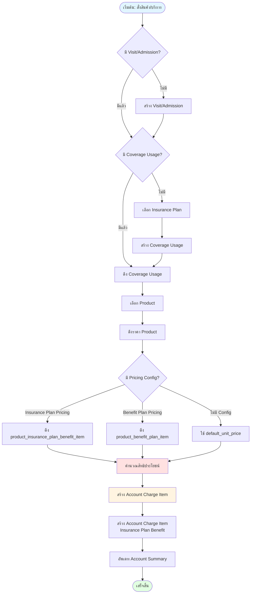
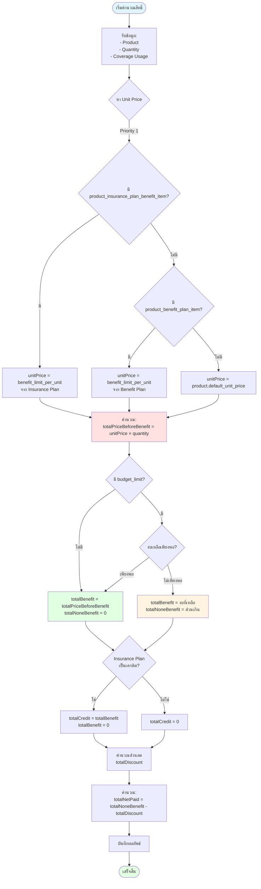
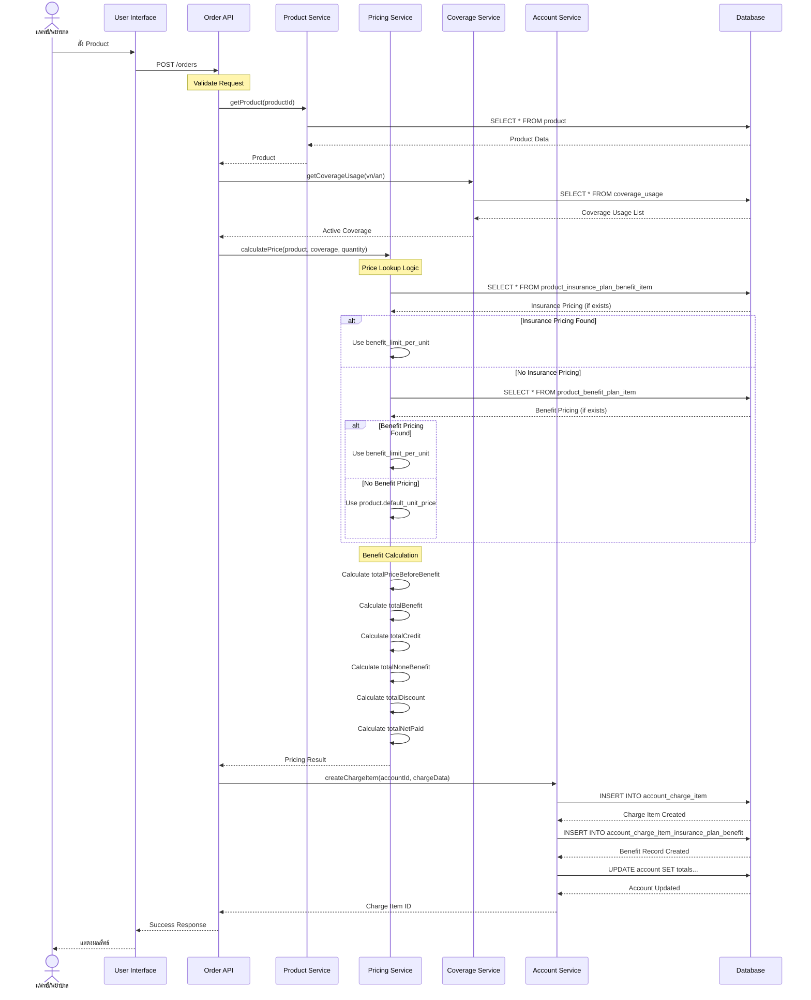
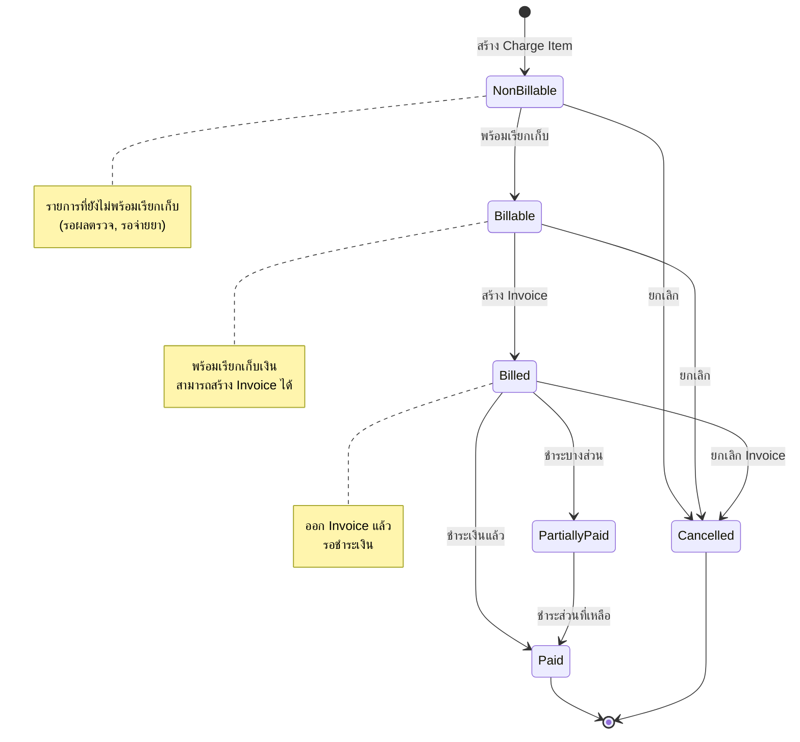
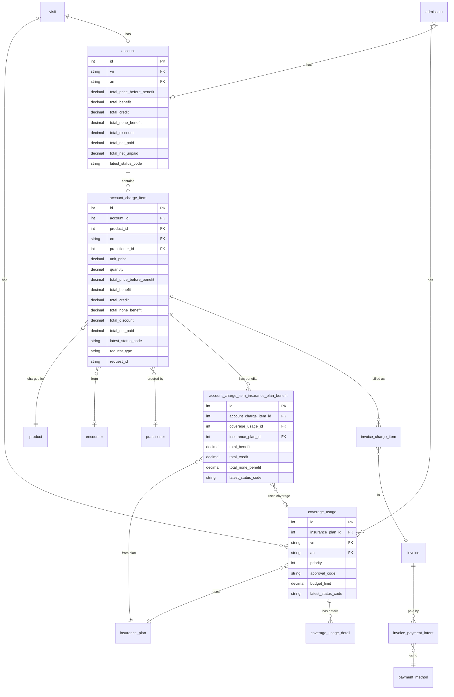

# Product Ordering with Insurance Benefit Calculation Logic

## ภาพรวม

เอกสารนี้อธิบาย logic การสั่งสินค้า/บริการ และการคำนวณสิทธิประโยชน์จากประกันในระบบ EMR

## 1. Overall Flow Diagram



## 2. Detailed Benefit Calculation Logic



## 3. Data Flow Sequence Diagram



## 4. State Diagram - Account Charge Item Status



## 5. Entity Relationship - Charging & Billing



## 6. Calculation Examples

### ตัวอย่างที่ 1: สิทธิ์ครอบคลุมเต็มจำนวน (Full Benefit)

```
Input:
- Product: Paracetamol 500mg
- Quantity: 10 เม็ด
- Insurance Plan: บัตรทอง (UC)
- benefit_limit_per_unit: 3.00 บาท/เม็ด
- budget_limit: ไม่จำกัด

Calculation:
1. totalPriceBeforeBenefit = 3.00 × 10 = 30.00 บาท
2. totalBenefit = 30.00 บาท (สิทธิ์จ่ายเต็ม)
3. totalCredit = 0 บาท (UC ไม่ใช่เครดิต)
4. totalNoneBenefit = 0 บาท
5. totalDiscount = 0 บาท
6. totalNetPaid = 0 บาท (ผู้ป่วยไม่ต้องจ่าย)

Result:
✓ ผู้ป่วยไม่ต้องจ่ายเงิน
✓ โรงพยาบาลเคลมจาก สปสช. 30.00 บาท
```

### ตัวอย่างที่ 2: สิทธิ์ครอบคลุมบางส่วน (Partial Benefit)

```
Input:
- Product: Amoxicillin 500mg
- Quantity: 21 แคปซูล
- Insurance Plan: บัตรทอง (UC)
- product.default_unit_price: 10.00 บาท/แคปซูล
- benefit_limit_per_unit: 7.00 บาท/แคปซูล
- budget_limit: ไม่จำกัด

Calculation:
1. totalPriceBeforeBenefit = 10.00 × 21 = 210.00 บาท
2. unitPrice ที่ใช้คำนวณสิทธิ์ = 7.00 บาท (จาก benefit_limit_per_unit)
3. totalBenefit = 7.00 × 21 = 147.00 บาท
4. totalCredit = 0 บาท
5. totalNoneBenefit = 210.00 - 147.00 = 63.00 บาท
6. totalDiscount = 0 บาท
7. totalNetPaid = 63.00 บาท (ผู้ป่วยจ่ายส่วนเกิน)

Result:
✓ ผู้ป่วยจ่าย 63.00 บาท
✓ โรงพยาบาลเคลมจาก สปสช. 147.00 บาท
```

### ตัวอย่างที่ 3: สิทธิ์แบบเครดิต (Credit)

```
Input:
- Product: Lab Test - CBC
- Quantity: 1 รายการ
- Insurance Plan: ประกันสังคม (SSS)
- benefit_limit_per_unit: 150.00 บาท
- budget_limit: ไม่จำกัด
- Insurance Plan Type: เครดิต (โรงพยาบาลเรียกเก็บเอง)

Calculation:
1. totalPriceBeforeBenefit = 150.00 × 1 = 150.00 บาท
2. totalBenefit = 0 บาท (เพราะเป็นเครดิต)
3. totalCredit = 150.00 บาท (โอนไปเป็นเครดิต)
4. totalNoneBenefit = 0 บาท
5. totalDiscount = 0 บาท
6. totalNetPaid = 0 บาท (ผู้ป่วยไม่ต้องจ่าย)

Result:
✓ ผู้ป่วยไม่ต้องจ่ายเงิน
✓ โรงพยาบาลเรียกเก็บจากประกันสังคมเอง 150.00 บาท
```

### ตัวอย่างที่ 4: งบประมาณไม่เพียงพอ (Budget Exceeded)

```
Input:
- Product: MRI Scan
- Quantity: 1 รายการ
- Insurance Plan: ประกันเอกชน
- product.default_unit_price: 8,000.00 บาท
- benefit_limit_per_unit: 5,000.00 บาท
- budget_limit: 10,000.00 บาท
- งบที่ใช้ไปแล้ว: 7,000.00 บาท
- งบคงเหลือ: 3,000.00 บาท

Calculation:
1. totalPriceBeforeBenefit = 8,000.00 × 1 = 8,000.00 บาท
2. benefit_limit_per_unit = 5,000.00 บาท
3. งบคงเหลือ = 3,000.00 บาท (น้อยกว่า benefit_limit)
4. totalBenefit = 3,000.00 บาท (ใช้งบที่เหลือทั้งหมด)
5. totalCredit = 0 บาท
6. totalNoneBenefit = 8,000.00 - 3,000.00 = 5,000.00 บาท
7. totalDiscount = 0 บาท
8. totalNetPaid = 5,000.00 บาท

Result:
✓ ผู้ป่วยจ่าย 5,000.00 บาท
✓ ประกันจ่าย 3,000.00 บาท (งบหมด)
```

### ตัวอย่างที่ 5: มีส่วนลด (With Discount)

```
Input:
- Product: Dental Cleaning
- Quantity: 1 รายการ
- Insurance Plan: ไม่มีสิทธิ์ (Self Pay)
- product.default_unit_price: 1,000.00 บาท
- discount: 10% (โปรโมชั่น)

Calculation:
1. totalPriceBeforeBenefit = 1,000.00 × 1 = 1,000.00 บาท
2. totalBenefit = 0 บาท (ไม่มีสิทธิ์)
3. totalCredit = 0 บาท
4. totalNoneBenefit = 1,000.00 บาท
5. totalDiscount = 1,000.00 × 10% = 100.00 บาท
6. totalNetPaid = 1,000.00 - 100.00 = 900.00 บาท

Result:
✓ ผู้ป่วยจ่าย 900.00 บาท (หลังหักส่วนลด)
```

## 7. Business Rules Summary

### 7.1 Price Lookup Priority
1. **product_insurance_plan_benefit_item** (สูงสุด)
   - ราคาเฉพาะ Insurance Plan + Product + Visit Class
2. **product_benefit_plan_item**
   - ราคาตาม Benefit Plan + Product + Visit Class
3. **product.default_unit_price** (ต่ำสุด)
   - ราคาเริ่มต้นของสินค้า

### 7.2 Benefit Calculation Rules
- **totalPriceBeforeBenefit** = unitPrice × quantity
- **totalBenefit** = min(benefit_limit_per_unit × quantity, budget_remaining)
- **totalCredit** = totalBenefit (ถ้า Insurance Plan เป็นเครดิต)
- **totalNoneBenefit** = totalPriceBeforeBenefit - totalBenefit
- **totalNetPaid** = totalNoneBenefit - totalDiscount

### 7.3 Visit Class Rules
- OPD (Outpatient) และ IPD (Inpatient) อาจมีราคาต่างกัน
- ตรวจสอบ `visit_class` หรือ `is_for_all_visit_class`

### 7.4 Budget Management
- ตรวจสอบ `budget_limit` ใน `coverage_usage`
- คำนวณงบคงเหลือจากรายการที่ใช้ไปแล้ว
- ถ้างบไม่พอ ให้ใช้งบที่เหลือทั้งหมด

### 7.5 Multiple Coverage Priority
- ผู้ป่วยอาจมีหลายสิทธิ์ (multiple coverage_usage)
- ใช้ `priority` เพื่อกำหนดลำดับการใช้สิทธิ์
- สิทธิ์ที่มี priority ต่ำกว่าจะถูกใช้ก่อน

### 7.6 Status Lifecycle
```
non-billable → billable → billed → paid
     ↓            ↓          ↓
  cancelled   cancelled  cancelled
```

## 8. API Endpoints (Example)

### Create Charge Item
```http
POST /api/accounts/{accountId}/charge-items
Content-Type: application/json

{
  "productId": 123,
  "quantity": 10,
  "encounterId": "EN-2024-001",
  "practitionerId": 456,
  "requestType": "MEDICATION",
  "requestId": "MED-REQ-001"
}

Response:
{
  "id": 789,
  "accountId": 1,
  "productId": 123,
  "unitPrice": 3.00,
  "quantity": 10,
  "totalPriceBeforeBenefit": 30.00,
  "totalBenefit": 30.00,
  "totalCredit": 0,
  "totalNoneBenefit": 0,
  "totalDiscount": 0,
  "totalNetPaid": 0,
  "latestStatusCode": "billable",
  "benefits": [
    {
      "insurancePlanId": 1,
      "insurancePlanName": "บัตรทอง",
      "coverageUsageId": 10,
      "totalBenefit": 30.00,
      "totalCredit": 0,
      "totalNoneBenefit": 0
    }
  ]
}
```

## 9. Error Handling

### Common Errors
1. **Product Not Found** - สินค้าไม่มีในระบบ
2. **No Active Coverage** - ไม่มีสิทธิ์ที่ active
3. **Budget Exceeded** - งบประมาณหมด
4. **Invalid Visit Class** - visit class ไม่ตรงกับ pricing config
5. **Account Locked** - บัญชีถูกล็อค ไม่สามารถเพิ่มรายการได้

### Validation Rules
- Product ต้อง active = true
- Quantity > 0
- Account ต้องไม่ถูก lock
- Coverage Usage ต้อง active = true
- Visit Class ต้องตรงกับ pricing config

## สรุป

ระบบการสั่งสินค้าและคำนวณสิทธิประโยชน์มีความซับซ้อนหลายขั้นตอน:

1. **Price Lookup** - หาราคาที่เหมาะสมจาก 3 แหล่ง
2. **Benefit Calculation** - คำนวณสิทธิ์ตามงบประมาณและ limit
3. **Credit vs Benefit** - แยกประเภทการจ่ายเงิน
4. **Budget Management** - ติดตามงบคงเหลือ
5. **Multiple Coverage** - รองรับหลายสิทธิ์
6. **Status Tracking** - ติดตามสถานะตลอด lifecycle

การออกแบบนี้ให้ความยืดหยุ่นสูงในการจัดการราคาและสิทธิประโยชน์ที่หลากหลาย พร้อมรองรับการเคลมและการเรียกเก็บเงินที่ซับซ้อน
