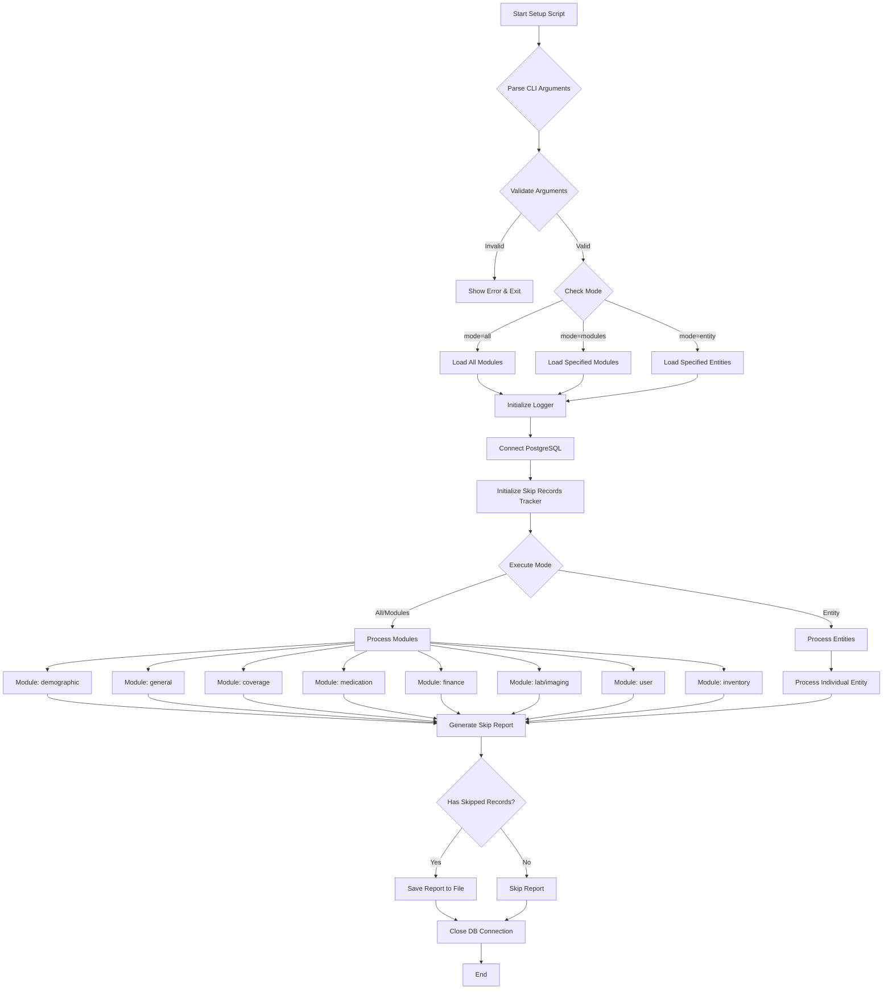
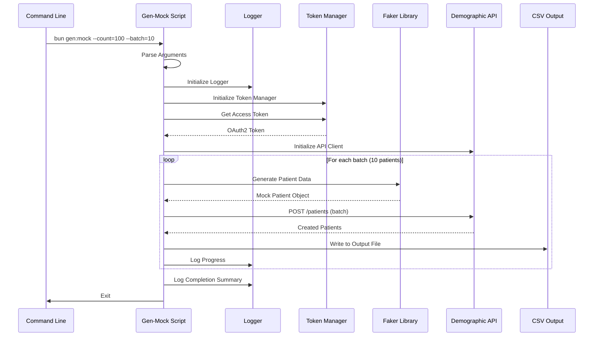
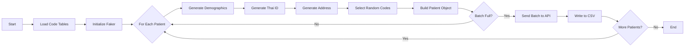
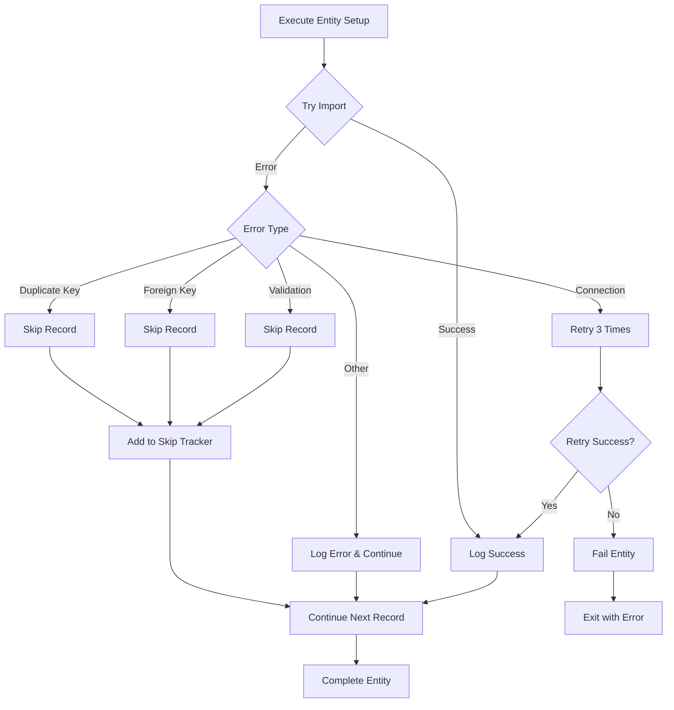
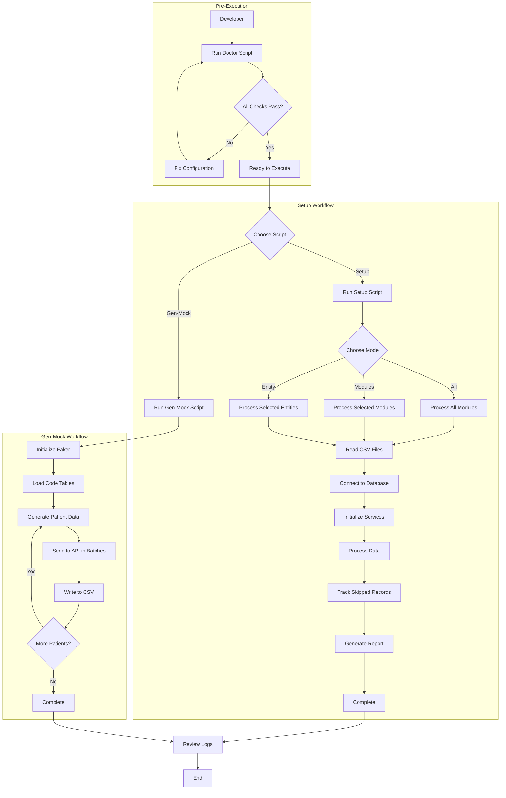

# Design Document: Mock Data Workflow

## Overview

เอกสารนี้อธิบาย workflow และ architecture ของระบบ Mock Data Scripts สำหรับโปรเจค Cortex Testing ซึ่งประกอบด้วย 3 scripts หลัก:

1. **Setup Script** - นำเข้าข้อมูล master data จาก CSV files
2. **Gen-Mock Script** - สร้างข้อมูล mock patients
3. **Doctor Script** - ตรวจสอบความพร้อมของระบบ

## Architecture

### System Components

```
┌─────────────────────────────────────────────────────────────┐
│                     Mock Data Scripts                        │
├─────────────────────────────────────────────────────────────┤
│                                                               │
│  ┌──────────────┐  ┌──────────────┐  ┌──────────────┐      │
│  │    Setup     │  │  Gen-Mock    │  │   Doctor     │      │
│  │   Script     │  │   Script     │  │   Script     │      │
│  └──────┬───────┘  └──────┬───────┘  └──────┬───────┘      │
│         │                  │                  │               │
└─────────┼──────────────────┼──────────────────┼──────────────┘
          │                  │                  │
          ├──────────────────┴──────────────────┤
          │                                      │
    ┌─────▼──────┐                      ┌───────▼────────┐
    │  Services  │                      │  Health Checks │
    ├────────────┤                      ├────────────────┤
    │ • Token    │                      │ • Env Vars     │
    │   Manager  │                      │ • PostgreSQL   │
    │ • Cortex   │                      │ • OAuth2       │
    │   API      │                      │ • APIs         │
    │ • Demo API │                      │ • Keycloak     │
    │ • Keycloak │                      └────────────────┘
    └─────┬──────┘
          │
    ┌─────▼──────────────────────────────┐
    │     External Dependencies          │
    ├────────────────────────────────────┤
    │ • PostgreSQL Database              │
    │ • Cortex API (Orders/Inventory)    │
    │ • Demographic API (Patients)       │
    │ • Keycloak (Authentication)        │
    │ • OAuth2 Token Service             │
    └────────────────────────────────────┘
```

## Components and Interfaces

### 1. Setup Script (`src/setup/index.js`)

#### Purpose
นำเข้าข้อมูล master data จาก CSV files เข้าสู่ PostgreSQL database และ APIs

#### Execution Modes



#### Module Structure

| Module | Storage | Entities Included |
|--------|---------|-------------------|
| demographic | PostgreSQL + API | nationality, occupation, education_level, language, marital_status, race, religion, gender, name_prefix, patient_category, thai_address, province, district, sub_district, blood_groups |
| general | PostgreSQL | branch, clinic, department, location, ward, queue_service_unit, location_type, document_type |
| coverage | PostgreSQL | benefit_plan, payor, insurance_plan, nhso_insurance_plan_mapping |
| medication | PostgreSQL + API | atc, medication_category, administrative_route, medication_spec_prep, nlem, dosage_form, tpu_atc_mapping |
| finance | PostgreSQL | product_category, nhso_category, csmbs_category, payment_category, payment_method |
| lab | API | lab test items |
| imaging | API | imaging procedures |
| user | PostgreSQL + Keycloak | users, practitioners |
| inventory | API | inventory items |

#### Service Initialization Pattern

```javascript
// Lazy initialization pattern
const services = {
  tokenManager: null,
  cortexApiClient: null,
  demographicApiClient: null,
  keycloakAdminClient: null
};

// Services are initialized only when needed
const getTokenManager = () => {
  if (!services.tokenManager) {
    services.tokenManager = createTokenManager({...});
  }
  return services.tokenManager;
};
```

### 2. Gen-Mock Script (`src/gen-mock/index.js`)

#### Purpose
สร้างข้อมูล mock patients โดยใช้ Faker library และบันทึกผ่าน Demographic API

#### Workflow



#### Patient Generation Flow



### 3. Doctor Script (`src/doctor/index.js`)

#### Purpose
ตรวจสอบความพร้อมของระบบและ configuration ก่อนรัน setup หรือ gen-mock scripts

#### Health Check Flow

```mermaid
graph TD
    A[Start Doctor Script] --> B[Load Environment Files]
    B --> C[Initialize Results Array]
    
    C --> D[Check 1: Environment Variables]
    D --> E{All Required Vars Set?}
    E -->|Yes| F[✅ PASS]
    E -->|No| G[🚫 FAIL: List Missing]
    
    F --> H[Check 2: PostgreSQL]
    G --> H
    
    H --> I[Connect to Database]
    I --> J{Connection Success?}
    J -->|Yes| K[✅ PASS]
    J -->|No| L[🚫 FAIL: Error Message]
    
    K --> M[Check 3: OAuth2 Token]
    L --> M
    
    M --> N[Request Access Token]
    N --> O{Token Acquired?}
    O -->|Yes| P[✅ PASS]
    O -->|No| Q[🚫 FAIL: HTTP Status]
    
    P --> R[Check 4: Cortex API]
    Q --> R
    
    R --> S[Try Health Endpoints]
    S --> T{API Reachable?}
    T -->|Yes| U[✅ PASS]
    T -->|No| V[🚫 FAIL: Connection Error]
    
    U --> W[Check 5: Demographic API]
    V --> W
    
    W --> X[Try Health Endpoints]
    X --> Y{API Reachable?}
    Y -->|Yes| Z[✅ PASS]
    Y -->|No| AA[🚫 FAIL: Connection Error]
    
    Z --> AB[Check 6: Keycloak]
    AA --> AB
    
    AB --> AC[Check Well-Known Endpoint]
    AC --> AD{Keycloak Available?}
    AD -->|Yes| AE[✅ PASS]
    AD -->|No| AF[🚫 FAIL: Connection Error]
    
    AE --> AG[Display Summary]
    AF --> AG
    
    AG --> AH{Any Failures?}
    AH -->|Yes| AI[Exit Code 1]
    AH -->|No| AJ[Exit Code 0]
```



## Data Models

### Skip Records Tracker

```javascript
class SkipRecordsTracker {
  constructor(logger) {
    this.logger = logger;
    this.skippedRecords = new Map(); // entity -> array of records
  }
  
  // Track a skipped record
  addSkippedRecord(entity, record, reason) {
    if (!this.skippedRecords.has(entity)) {
      this.skippedRecords.set(entity, []);
    }
    this.skippedRecords.get(entity).push({ record, reason });
  }
  
  // Get total count
  getTotalSkippedCount() {
    let total = 0;
    for (const records of this.skippedRecords.values()) {
      total += records.length;
    }
    return total;
  }
  
  // Generate report
  logReport() {
    // Log summary to console
  }
  
  // Save to file
  saveReportToFile(path) {
    // Write detailed report
  }
}
```

### Token Manager

```javascript
class TokenManager {
  constructor({ tokenUrl, clientId, clientSecret }) {
    this.tokenUrl = tokenUrl;
    this.clientId = clientId;
    this.clientSecret = clientSecret;
    this.accessToken = null;
    this.expiresAt = null;
  }
  
  async getAccessToken() {
    // Check if token is still valid
    if (this.accessToken && this.expiresAt > Date.now()) {
      return this.accessToken;
    }
    
    // Request new token
    const response = await axios.post(this.tokenUrl, {
      grant_type: 'client_credentials',
      client_id: this.clientId,
      client_secret: this.clientSecret
    });
    
    this.accessToken = response.data.access_token;
    this.expiresAt = Date.now() + (response.data.expires_in * 1000);
    
    return this.accessToken;
  }
}
```

### CSV Data Structure

```
data/
├── demographic/
│   ├── nationality.csv
│   ├── occupation.csv
│   ├── education_level.csv
│   └── ...
├── general/
│   ├── branch.csv
│   ├── clinic.csv
│   ├── department.csv
│   └── ...
├── coverage/
│   ├── benefit_plan.csv
│   ├── payor.csv
│   └── insurance_plan.csv
├── medication/
│   ├── atc.csv
│   ├── medication_category.csv
│   └── ...
├── finance/
│   ├── product_category.csv
│   ├── nhso_category.csv
│   └── ...
└── order-data/
    ├── lab.csv
    ├── imaging.csv
    └── currency.csv
```

## Error Handling

### Setup Script Error Handling



### Error Categories

| Category | Handling Strategy | Example |
|----------|------------------|---------|
| Validation Error | Skip record, log to tracker | Invalid date format, missing required field |
| Duplicate Key | Skip record, log to tracker | Record already exists in database |
| Foreign Key | Skip record, log to tracker | Referenced entity not found |
| Connection Error | Retry 3 times, then fail | Database connection lost |
| Authentication Error | Fail immediately | Invalid OAuth2 credentials |
| API Error (4xx) | Skip record, log to tracker | Bad request, validation failed |
| API Error (5xx) | Retry 3 times, then skip | Server error, timeout |

## Testing Strategy

### Unit Testing Focus Areas

1. **Argument Parsing**
   - Valid argument combinations
   - Invalid argument validation
   - Default values

2. **Service Initialization**
   - Lazy loading behavior
   - Token refresh logic
   - Connection pooling

3. **CSV Processing**
   - File reading
   - Data transformation
   - Error handling

4. **Skip Records Tracker**
   - Record tracking
   - Report generation
   - File output

### Integration Testing Focus Areas

1. **Database Operations**
   - Connection management
   - Transaction handling
   - Bulk inserts

2. **API Interactions**
   - Authentication flow
   - Batch processing
   - Error responses

3. **End-to-End Workflows**
   - Complete module setup
   - Patient generation
   - Health checks

### Manual Testing Scenarios

1. **Setup Script**
   ```bash
   # Test all modules
   bun setup --mode=all --log-file=logs/test.log
   
   # Test specific module
   bun setup --mode=modules --modules=demographic
   
   # Test specific entity
   bun setup --mode=entity --entities=nationality,occupation
   
   # Test with custom data directory
   bun setup --mode=entity --entities=branch --data-dir=./test-data
   ```

2. **Gen-Mock Script**
   ```bash
   # Generate 10 patients
   bun gen:mock --count=10 --batch=5
   
   # Generate with custom output
   bun gen:mock --count=100 --output-dir=./test-output
   ```

3. **Doctor Script**
   ```bash
   # Run health checks
   bun doctor
   ```

## Command Reference

### Setup Script Commands

```bash
# Basic usage - setup all modules
bun setup

# Setup with logging
bun setup --log-file=logs/setup.log

# Setup specific modules
bun setup --mode=modules --modules=demographic,general

# Setup specific entities
bun setup --mode=entity --entities=nationality,occupation

# Setup with custom data directory
bun setup --data-dir=./projects/test/data

# Setup with verbose logging
bun setup --verbose --log-file=logs/verbose.log

# Combined example
bun setup --mode=modules --modules=demographic --data-dir=./data --log-file=logs/demo.log
```

### Gen-Mock Script Commands

```bash
# Generate 1 patient (default)
bun gen:mock

# Generate 100 patients
bun gen:mock --count=100

# Generate with custom batch size
bun gen:mock --count=100 --batch=20

# Generate with custom output directory
bun gen:mock --count=50 --output-dir=./output/patients

# Generate with logging
bun gen:mock --count=100 --log-file=logs/gen-mock.log

# Generate with verbose output
bun gen:mock --count=10 --verbose

# Combined example
bun gen:mock --count=200 --batch=25 --output-dir=./test-output --log-file=logs/mock.log
```

### Doctor Script Commands

```bash
# Run all health checks
bun doctor

# Output will show:
# ✅ PASS - Check succeeded
# ⏩ SKIP - Check skipped (missing config)
# 🚫 FAIL - Check failed
```

### Command Line Options Reference

#### Setup Script Options

| Option | Alias | Type | Default | Description |
|--------|-------|------|---------|-------------|
| `--mode` | `-m` | string | `all` | Execution mode: all, modules, entity |
| `--modules` | - | string | - | Comma-separated list of modules |
| `--entities` | - | string | - | Comma-separated list of entities |
| `--log-file` | `-l` | string | `null` | Path to log file |
| `--verbose` | `-v` | boolean | `false` | Enable verbose logging |
| `--data-dir` | `-d` | string | `./data` | Path to data directory |
| `--help` | `-h` | - | - | Show help |

#### Gen-Mock Script Options

| Option | Alias | Type | Default | Description |
|--------|-------|------|---------|-------------|
| `--type` | `-t` | string | `patient` | Mock data type to generate |
| `--count` | `-c` | number | `1` | Number of records to generate |
| `--batch` | `-b` | number | `10` | Batch size for API calls |
| `--output-dir` | `-o` | string | `output` | Directory to write generated CSVs |
| `--log-file` | `-l` | string | `null` | Path to log file |
| `--verbose` | `-v` | boolean | `false` | Enable verbose logging |
| `--data-dir` | `-d` | string | `./data` | Path to data directory |
| `--help` | `-h` | - | - | Show help |

## Environment Variables

### Required Variables

```bash
# OAuth2 Configuration
OAUTH2_TOKEN_URL=https://auth.example.com/oauth/token
CLIENT_ID=your-client-id
CLIENT_SECRET=your-client-secret

# API Endpoints
CORTEX_API_URL=https://api.example.com/cortex
DEMOGRAPHIC_API_URL=https://api.example.com/demographic

# Keycloak Configuration
KEYCLOAK_BASE_URL=https://keycloak.example.com
KEYCLOAK_REALM=your-realm

# PostgreSQL Configuration
POSTGRES_HOST=localhost
POSTGRES_PORT=5432
POSTGRES_DB=emr
POSTGRES_USER=postgres
POSTGRES_PASSWORD=postgres
POSTGRES_SSL_MODE=disable
```

### Optional Variables

```bash
# Doctor Script
DOCTOR_TIMEOUT_MS=5000  # API health check timeout
```

## Performance Considerations

### Batch Processing

- **Setup Script**: Processes CSV files row by row, uses database transactions for consistency
- **Gen-Mock Script**: Processes patients in configurable batches (default: 10)
- **Recommended batch sizes**:
  - Small datasets (< 100 records): batch size 10
  - Medium datasets (100-1000 records): batch size 25
  - Large datasets (> 1000 records): batch size 50

### Connection Pooling

```javascript
// PostgreSQL connection pool configuration
const sql = postgres({
  host: process.env.POSTGRES_HOST,
  port: process.env.POSTGRES_PORT,
  database: process.env.POSTGRES_DB,
  username: process.env.POSTGRES_USER,
  password: process.env.POSTGRES_PASSWORD,
  max: 10,              // Maximum pool size
  idle_timeout: 30,     // Idle connection timeout (seconds)
  connect_timeout: 10   // Connection timeout (seconds)
});
```

### Token Caching

- Token Manager caches OAuth2 access tokens
- Tokens are reused until expiration
- Automatic refresh when expired
- Shared across all API clients

## Troubleshooting Guide

### Common Issues

#### 1. Environment Variables Not Set

**Symptom**: Doctor script shows missing environment variables

**Solution**:
```bash
# Copy sample env file
cp src/setup/.env.sample .env

# Edit and fill in values
nano .env
```

#### 2. Database Connection Failed

**Symptom**: PostgreSQL connectivity check fails

**Solutions**:
- Verify PostgreSQL is running: `pg_isready`
- Check connection parameters in .env
- Verify network connectivity
- Check firewall rules

#### 3. OAuth2 Token Acquisition Failed

**Symptom**: Token acquisition returns 401 or 403

**Solutions**:
- Verify CLIENT_ID and CLIENT_SECRET
- Check OAUTH2_TOKEN_URL is correct
- Ensure client has required permissions
- Check token service logs

#### 4. API Endpoints Unreachable

**Symptom**: API health checks fail

**Solutions**:
- Verify API URLs in .env
- Check network connectivity
- Verify APIs are running
- Check firewall/proxy settings

#### 5. CSV File Not Found

**Symptom**: Setup script fails with file not found error

**Solutions**:
- Verify data directory structure
- Check file names match expected format
- Use --data-dir to specify correct path
- Ensure CSV files have correct encoding (UTF-8)

#### 6. Duplicate Key Errors

**Symptom**: Many records skipped due to duplicate keys

**Solutions**:
- Check if data was already imported
- Review skip records report
- Clear database tables if re-importing
- Verify CSV data doesn't have duplicates

#### 7. Foreign Key Constraint Violations

**Symptom**: Records skipped due to missing references

**Solutions**:
- Import modules in correct order
- Ensure referenced entities exist
- Check entity dependencies
- Review skip records report for details

## Diagram Summary

### Complete System Workflow



This design provides a comprehensive blueprint for implementing workflow documentation and diagrams for the mock data scripts system.
